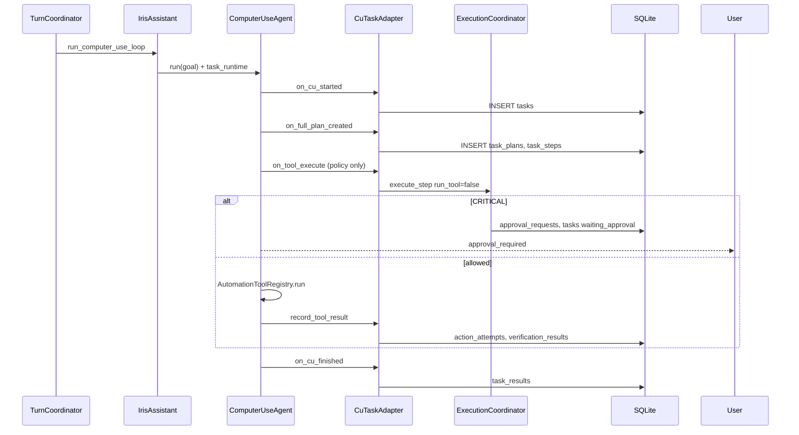

# Task Runtime 설계

- 버전: 1.0 (Phase 1 구현)
- 상태: Implemented
- 참고: [iris-domain-design-v2.md](../iris-domain-design-v2.md)

---

## 1. 목표

Computer Use·승인·검증·복구 상태를 **하나의 Task ID** 아래 통합한다.

```text
User Request
→ Task
→ Plan → PlanStep
→ ActionProposal → PolicyDecision
→ ApprovalRequest (필요 시)
→ ActionAttempt → ActionResult
→ VerificationResult
→ TaskCheckpoint / TaskResult
```

---

## 2. 패키지 구조

```text
iris/iris/
├─ domain/
│  ├─ task/          models, enums, events, repositories, transitions
│  ├─ execution/     models, enums, policy ports, repositories
│  ├─ monitoring/    TaskMonitoringLink
│  └─ shared/        id_generator, time, result, entity_ref
├─ application/
│  ├─ task_service.py
│  ├─ execution_coordinator.py
│  ├─ approval_service.py
│  ├─ verification_service.py
│  ├─ recovery_service.py
│  └─ runtime_factory.py
└─ infrastructure/
   ├─ persistence/   migrations, sqlite_repositories
   ├─ adapters/      cu_task_adapter, safety_policy_adapter, tool_registry_adapter
   └─ events/        in_memory_dispatcher, task_status_bridge
```

---

## 3. 핵심 모델

| 모델 | 책임 |
|------|------|
| `Task` | 사용자 목표, 상태, active_plan_id |
| `Plan` / `PlanStep` | 버전 관리 실행 계획·단계 |
| `ActionProposal` | 실행 전 행동 제안 |
| `PolicyDecision` | allow / require_approval / deny |
| `ApprovalRequest` | tool_name + arguments_hash 바인딩 |
| `ActionAttempt` / `ActionResult` | 실제 실행 기록 |
| `VerificationResult` | 목표 달성 검증 |
| `TaskCheckpoint` | 승인 대기·복구 스냅샷 |
| `TaskResult` | 최종 결과 |

---

## 4. 실행 흐름 (Computer Use 연동)



---

## 5. 레거시 연결

| 레거시 | 연결 방식 |
|--------|-----------|
| `ComputerUseAgent` | optional `task_runtime` 훅 (None이면 기존 동작) |
| `AutomationToolRegistry` | `ToolRegistryAdapter` |
| `SafetyGuard` | `SafetyPolicyAdapter` |
| `task_sessions` | **병행 유지** — `MemoryManager` 계속 호출 |
| `PendingComputerUseGoal` | 메모리 승인 + DB `approval_requests` |

제거 조건 (TODO): `tasks` 테이블에 모든 CU 세션이 기록되고 UI가 Task ID로 조회할 때 `task_sessions` 제거.

---

## 6. 도메인 이벤트

`TaskCreated`, `PlanCreated`, `ActionProposed`, `ApprovalRequested`, `ActionAttemptCompleted`, `VerificationCompleted`, `TaskCompleted` 등.

초기 구현: `InMemoryEventDispatcher` + `TaskStatusEventBridge`.

---

## 7. 테스트

- `test_domain_task_transitions.py`
- `test_sqlite_task_repositories.py`
- `test_execution_coordinator.py`
- `test_approval_binding.py`
- `test_cu_task_adapter.py`

회귀: 기존 592 tests passed (integration 제외).
