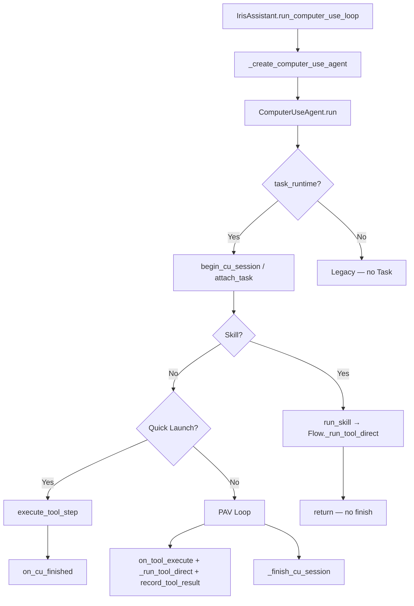

# Task Runtime 실제 통합 분석

> Phase 0 산출물 — `main` 기준 (커밋 `0fcfeea` + 워킹트리) 실행 경로·갭·수정 대상

## 1. `task_runtime` 생성 위치

| 위치 | 메서드 | 반환 타입 | 시점 |
|------|--------|-----------|------|
| `iris/assistant/agent_adapter.py` | `_ensure_task_runtime()` | `CuTaskAdapter \| None` | lazy — CU Agent 생성·TurnCoordinator 승인/취소 시 |
| `iris/application/runtime_factory.py` | `build_task_runtime(db, registry)` | `TaskRuntimeServices` | `_ensure_task_runtime()` 내부 |
| `iris/infrastructure/adapters/cu_task_adapter.py` | `CuTaskAdapter(runtime)` | Adapter | `_ensure_task_runtime()` 내부 |
| `iris/ui/main_window.py` | `_check_recoverable_tasks()` | `TaskRuntimeServices` (로컬) | 앱 시작 deferred startup |
| `iris/assistant/turn_coordinator.py` | pending CU reject | `bundle.recovery.abandon_task()` | 승인 거부 시 |

**초기화 흐름:**

```
IrisAssistant.__init__
  └─ _task_runtime_bundle = None
  └─ _cu_task_adapter = None

_create_computer_use_agent()
  └─ task_runtime = _ensure_task_runtime()
       └─ build_task_runtime(db, tool_registry)
       └─ CuTaskAdapter(bundle)
       └─ TaskStatusEventBridge 구독
```

**예외 처리:** `_ensure_task_runtime()` 실패 시 `logger.exception`, `TaskRuntimeHealth.mark_failed`, DB log `task_runtime/init_failed`. `IRIS_STRICT_TASK_RUNTIME=1`이면 re-raise, 아니면 `None` 반환(레거시 폴백).

## 2. `ComputerUseAgent` 주입 여부

| 호출부 | `task_runtime` 전달 | 비고 |
|--------|---------------------|------|
| `_create_computer_use_agent()` | ✅ `self._ensure_task_runtime()` | 정상 경로 |
| `run_computer_use_loop()` | ✅ `_create_computer_use_agent()` 경유 | |
| `run_computer_use_resume()` | ✅ 동일 | |
| `run_pending_cu_tool()` | ❌ `ComputerUseAgent(...)` 직접 생성, `task_runtime` 없음 | **갭** |
| 테스트 다수 | ❌ `ComputerUseAgent(assistant, gemma, registry)` | 의도적 legacy |

`ComputerUseAgent.__init__` 시그니처:

```python
def __init__(..., task_runtime: CuTaskRuntimePort | None = None)
self._task_runtime = task_runtime
```

→ **Phase 1은 대부분 완료**. `run_pending_cu_tool` 레거시 경로만 미연결.

## 3. Task가 생성되는 정확한 위치

| 경로 | Task 생성 시점 | 메서드 |
|------|----------------|--------|
| CU `run()` 진입 (공통) | Skill/Quick Launch/PAV **이전** | `CuTaskAdapter.begin_cu_session(goal, slots)` |
| 재개 (`_resume_task_id`) | attach only | `CuTaskAdapter.attach_task(resume_tid)` |
| PAV fallback (중복 guard) | `task_id` 없을 때만 | `begin_cu_session` (L190-199, 이중 방어) |
| Full Plan | PAV 세션 중 | `on_full_plan_created(items)` → Plan/Steps |
| Adapter 직접 (테스트) | `CuTaskAdapter.begin_cu_session` | |

`begin_cu_session` 내부:

```
TaskApplicationService.create_task_from_cu_request
→ start_task
→ ensure_adhoc_plan (Plan + PlanStep)
```

## 4. Task를 우회하는 조기 반환 경로

| # | 경로 | Task 생성 | 실행 기록 | 종료 처리 | 상태 |
|---|------|-----------|-----------|-----------|------|
| 1 | Skill (`run_skill`) | ✅ (run 진입 시) | ❌ Flow가 `_run_tool_direct` | ❌ `on_cu_finished` 미호출 | **갭 P3** |
| 2 | Quick Launch | ✅ | ✅ `execute_tool_step` | ✅ `on_cu_finished(success=True)` | 부분 OK — lightweight verify |
| 3 | PAV `_execute_tool` | ✅ | ⚠️ 이중 트랙: `on_tool_execute(run_tool=False)` + `_run_tool_direct` + `record_tool_result` | `_finish_cu_session` | **갭 P3/P5** |
| 4 | CRITICAL 승인 대기 | ✅ | ✅ proposal + approval | `exit_tag=approval` → 상태 유지 | OK |
| 5 | 승인 재개 | attach | ✅ `execute_approved_proposal` (runtime 있을 때) | `_finish_cu_session` | OK (runtime 없으면 `_run_tool_direct`) |
| 6 | `run_pending_cu_tool` | ❌ | ❌ | — | **갭 P1/P4** |
| 7 | Skill Flow 내부 (`text_compose`, `send_message`, `media_playback`) | Task는 상위에서 생성 | ❌ `_agent._run_tool_direct` | — | **갭 P3** |
| 8 | Tier4 delegate | Task 있음 | 별도 | `_finish_cu_session` | 기록 약함 (허용) |

**Skill 조기 반환 예:** `USER_QUESTION_PREFIX` 질문 — Task는 RUNNING인 채 종료 처리 없음.

## 5. 승인 후 실제 Tool 실행 경로

```
TurnCoordinator._handle_pending_cu_followup (APPROVE)
  → IrisAssistant.run_computer_use_resume(pending)
    → ComputerUseAgent.resume_after_critical_approval(pending)

[task_runtime != None]
  → attach_task(task_id)
  → on_approval_granted(tool_name, params)
  → execute_approved_proposal(proposal_id, approval_id, ...)  ← ExecutionCoordinator.execute_proposal
  → checkpoint verify / PAV 계속

[task_runtime == None]
  → _run_tool_direct(...)  ← 레거시, 기록 없음
```

`ExecutionCoordinator.execute_proposal`:

```
Proposal 로드 → Task/Step 확인
→ prior succeeded attempt 중복 차단
→ ApprovalService.validate_for_execution (hash, expiry, granted)
→ execute_step(run_tool=True, skip_proposal_save=True)
```

Pending slots에 저장: `_task_id`, `_task_proposal_id`, `_task_approval_id` (`_execute_tool` approval 분기).

## 6. Task 종료 상태 처리 위치

| 종료 이유 | 처리 위치 | Task 상태 |
|-----------|-----------|-----------|
| PAV success | `_finish_cu_session` → `on_cu_finished(success=True)` | COMPLETED |
| ask_user | `_finish_cu_session` → `on_cu_waiting_user` | WAITING_USER |
| max_steps | `_finish_cu_session` → `on_cu_suspended` | SUSPENDED |
| approval | `_finish_cu_session` pass | WAITING_APPROVAL 유지 |
| failure / parse_abort | `on_cu_finished(success=False)` | FAILED |
| Quick Launch success | `run()` 직접 `on_cu_finished(success=True)` | COMPLETED |
| Skill 완료/실패 | **미처리** | RUNNING 잔류 가능 | **갭 P6** |
| Recovery abandon | `RecoveryService.abandon_task` | CANCELLED |

## 7. Task Runtime 초기화 실패 처리

- `TaskRuntimeHealth` (`application/task_runtime_health.py`): `healthy | degraded | failed`
- 실패 시: stack trace log, `mark_failed`, DB `task_runtime/init_failed`
- `main_window._check_recoverable_tasks`: health failed면 채팅 경고
- `IRIS_STRICT_TASK_RUNTIME=1`: 테스트/개발에서 re-raise
- **잔여 갭:** production degraded fallback 시 명시적 `mark_degraded` 이벤트 미발행 (Phase 7)

## 8. DB Migration과 Foreign Key 적용 위치

```
Database.__init__
  → PRAGMA foreign_keys=ON          (database.py:38)
  → _migrate_legacy_actions()
  → _init_schema()                  (legacy tables)
  → _run_task_runtime_migrations()
       → migrations.run_pending_migrations(conn)
            001_create_task_runtime
            002_create_execution_records
            003_...
            005_plan_integrity        (orphan step 거부)
```

Repository: `SqliteRepositoryBundle` — `plans.save_step`에서 parent plan FK 검증.

테스트: `test_foreign_key_check_has_no_errors`, `test_step_without_plan_is_rejected`.

## 9. 이번 작업에서 수정할 파일 목록

### Phase 1 — Runtime 주입

- `iris/assistant/agent_adapter.py` — `run_pending_cu_tool` → `_create_computer_use_agent()` 사용
- `iris/tests/test_task_runtime_integration.py` (신규) — IrisAssistant·ComputerUseAgent 생성 테스트

### Phase 2 — Task 선행 생성

- `iris/assistant/computer_use_agent.py` — Skill 반환 시 Task 종료/대기 처리
- `iris/tests/test_task_runtime_integration.py` — `ComputerUseAgent.run()` 실경로 Task 생성 테스트

### Phase 3 — Quick Launch / Skill 기록

- `iris/assistant/computer_use_agent.py` — `_run_tool_via_runtime()` 헬퍼 (선택)
- `iris/assistant/text_compose_flow.py`, `send_message_flow.py`, `media_playback_flow.py` — runtime 경유 실행
- `iris/infrastructure/adapters/cu_task_adapter.py` — Quick Launch 프로세스/창 검증 강화
- `iris/tests/` — proposal/attempt/result/verification 기록 테스트

### Phase 4 — 승인 재개 통합

- `iris/assistant/computer_use_agent.py` — PAV `_execute_tool` runtime 활성 시 `execute_tool_step` 단일 경로
- `iris/tests/` — real approval resume through agent

### Phase 5 — Verification 후 Step 완료

- `iris/assistant/computer_use_agent.py` — `record_tool_result` 경로 정리
- `iris/infrastructure/adapters/cu_task_adapter.py` — lightweight verify vs checkpoint 분리
- `iris/application/verification_service.py` — (현재 UNKNOWN 관측은 step 미완료 — 유지)

### Phase 6 — 종료 상태 매핑

- `iris/assistant/computer_use_agent.py` — Skill/Quick Launch 공통 `_finish_task_runtime(reason)` 
- `iris/infrastructure/adapters/cu_task_adapter.py` — `on_cu_finished` 매핑 보강

### Phase 7 — Init 실패 노출

- `iris/assistant/agent_adapter.py` — degraded fallback 시 `mark_degraded`
- `iris/tests/` — legacy fallback emits degraded

### Phase 8 — DB FK/Migration

- `iris/storage/database.py` — (이미 적용됨, 회귀 테스트만)
- `iris/infrastructure/persistence/migrations.py` — (유지)

### Phase 9 — 실제 통합 테스트

- `iris/tests/test_task_runtime_real_integration.py` (신규) — IrisAssistant → CU → DB 전체 체인

### Phase 10 — 재시작 복구

- `iris/ui/main_window.py` — (기본 배선 있음)
- `iris/assistant/turn_coordinator.py` — 복구 Task 재개 slots (`_resume_task_id`)
- `iris/tests/` — restart simulation

---

## 실행 경로 다이어그램 (현재)



## 우선순위 요약

1. **P0** Skill Flow Task 기록·종료 누락
2. **P0** PAV 이중 실행 트랙 → `execute_tool_step` 단일화
3. **P1** `run_pending_cu_tool` runtime 미주입
4. **P1** IrisAssistant 경로 통합 테스트 부재
5. **P2** Skill ask_user 시 WAITING_USER 미전환
6. **P2** degraded fallback 이벤트

## 기존 테스트 현황

- `tests/test_task_runtime_stabilization.py` — 35 tests, Adapter/Service 직접 호출 위주
- `tests/test_execution_coordinator.py`, `tests/test_sqlite_task_repositories.py` — 통과
- **부재:** `test_real_*`, `test_iris_assistant_can_construct_computer_use_agent` 등 사용자 명세 테스트명
- 전체 suite: 619 passed, 1 flaky (`test_llm_unavailable_fallback` — 단독 실행 시 통과)
